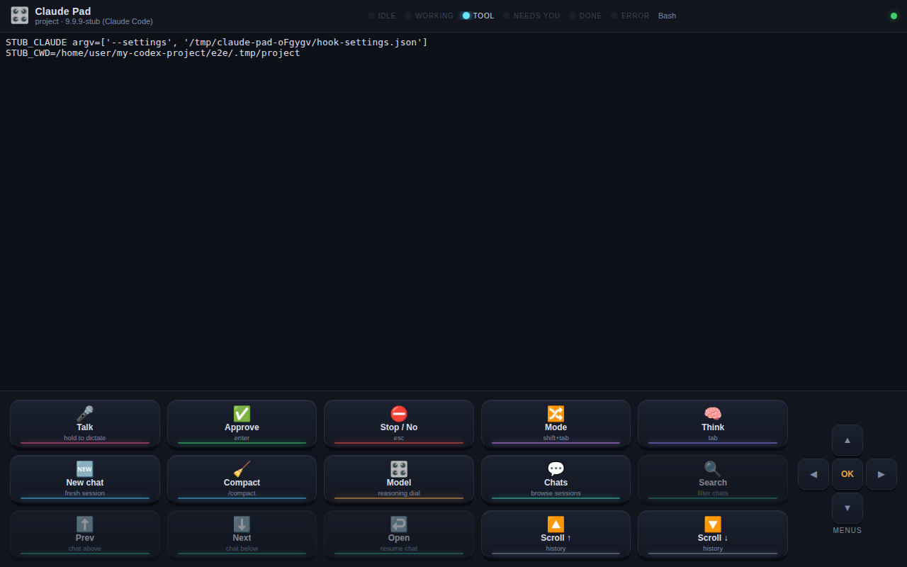
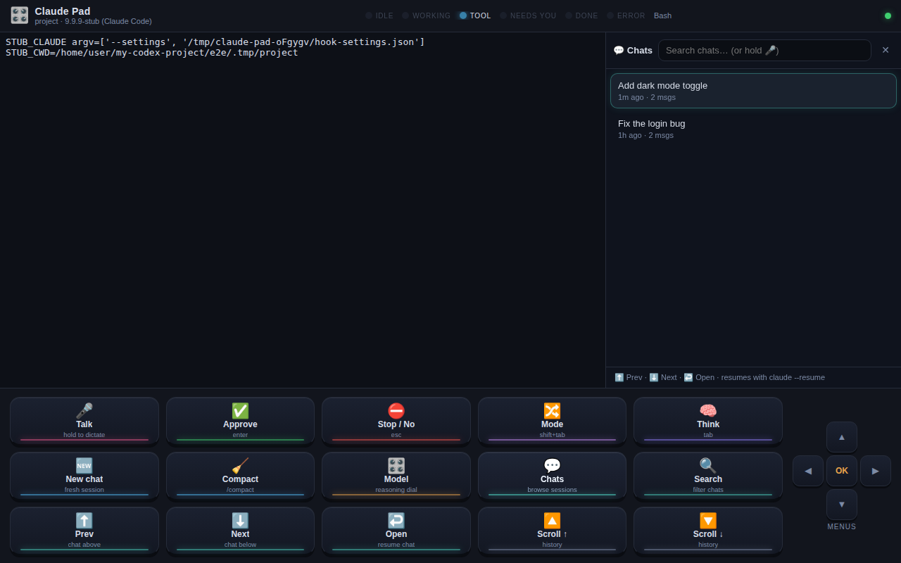
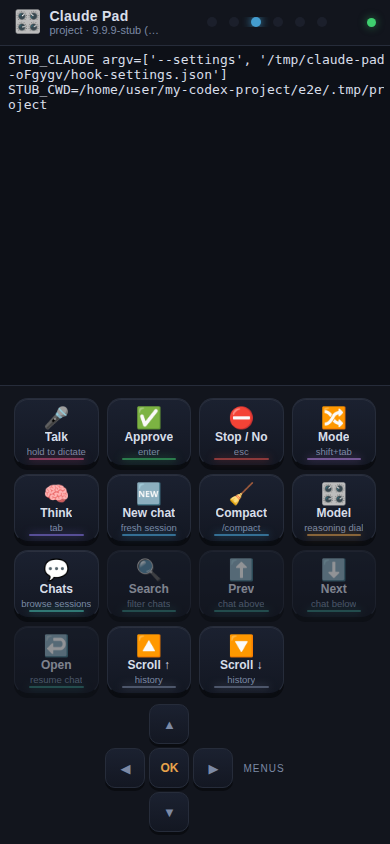

# 🎛️ Claude Pad

**A Codex-Micro-style virtual macropad for Claude Code** — 15 big keys, agent-status LEDs, a reasoning dial, a d-pad "joystick", push-to-talk dictation, and a searchable chat browser, wrapped around a live terminal running the real `claude` CLI.

Inspired by OpenAI's Codex Micro hardware macropad, but in software, for Claude Code — and **$0 extra**: because Claude Pad drives the real interactive CLI in a pseudo-terminal, everything runs on your existing Claude subscription (Pro/Max/Team). No API key, no per-token billing. Voice input uses your browser's built-in speech recognition — also free.



Open it on your phone (same Wi-Fi) and the phone becomes the physical pad next to your keyboard:

| Chat browser | Phone pad |
|---|---|
|  |  |

## How it works

```
┌─────────────── browser (desktop or phone) ───────────────┐
│  live terminal (xterm.js)  +  15-key pad  +  status LEDs │
└───────────────────────────┬──────────────────────────────┘
                     WebSocket (JSON + base64 PTY bytes)
┌───────────────────────────┴──────────────────────────────┐
│  claude-pad server (Node) — spawns `claude` in a PTY,    │
│  replays output on reconnect, receives lifecycle hooks   │
└───────────────────────────┬──────────────────────────────┘
                       node-pty (keystrokes ⇅ output)
                 ┌──────────┴──────────┐
                 │  the real `claude`  │  ← your subscription
                 └─────────────────────┘
```

- **Keys are keystrokes.** Every key sends the exact sequence the TUI expects (Enter, Esc, Tab, Shift+Tab, arrows) or types a command (`/compact`, `/model sonnet`). The terminal stays fully interactive — the pad is a shortcut layer, not a cage.
- **LEDs are hook-driven, not screen-scraped.** The server launches `claude --settings <generated file>` wiring `SessionStart` / `UserPromptSubmit` / `PreToolUse` / `PostToolUse` / `Notification` / `Stop` / `SessionEnd` hooks to POST back to the pad server, which reduces them to: idle · working · tool · **needs you** · done · error. Your own settings files are never touched.
- **Chats are real sessions.** The chat browser reads Claude Code's own per-project transcripts (`~/.claude/projects/…`), so search/scroll/open works across everything you've done in that project; opening a chat relaunches `claude --resume <session-id>`.

## Quickstart

Prerequisites: Node 20+, [Claude Code](https://code.claude.com/docs) installed and logged in (`npm i -g @anthropic-ai/claude-code`, then run `claude` once to sign in with your Claude account).

```bash
npm install
npm run build
node bin/claude-pad.js --dir ~/code/your-project
# → open http://localhost:7433
```

`--dir` is the project Claude Code works in (defaults to the current directory).

### The 15 keys

| Key | Does |
|---|---|
| 🎤 **Talk** | hold to dictate; release to type it into claude (auto-submit configurable). With the chat browser open, dictates into search |
| ✅ **Approve** | Enter — accepts the highlighted option in permission dialogs |
| ⛔ **Stop / No** | Escape — rejects dialogs / interrupts a running turn |
| 🔀 **Mode** | Shift+Tab — cycles default → auto-accept → plan mode |
| 🧠 **Think** | Tab — toggles extended thinking |
| 🆕 **New chat** | relaunches claude fresh (a new conversation) |
| 🧹 **Compact** | types `/compact` |
| 🎛️ **Model** | the reasoning dial — cycles `/model haiku → sonnet → opus` |
| 💬 **Chats** | toggles the chat browser |
| 🔍 **Search** | focuses chat search |
| ⬆️ **Prev** / ⬇️ **Next** | move the chat highlight |
| ↩️ **Open** | resumes the highlighted chat (`claude --resume`) |
| 🔼 / 🔽 **Scroll** | page through terminal history |

The **d-pad** on the right sends arrow keys + Enter for claude's interactive menus (`/model` picker, permission option lists, `/resume` picker).

### Voice

Push-to-talk uses the Web Speech API (Chrome, Edge, Safari — no keys, no cost). It requires a secure context: `http://localhost` works out of the box; for a phone over LAN see below. If speech isn't available, the Talk key shows as disabled — everything else still works.

Set `"autoSubmitVoice": false` in `claudepad.config.json` if you want to review dictation before pressing ✅ to send.

### Using your phone as the pad

```bash
node bin/claude-pad.js --dir ~/code/your-project --host 0.0.0.0
```

The server prints a `http://<your-lan-ip>:7433/?token=…` URL — the token is required (anyone who can reach the pad controls a terminal on your machine; treat the URL like a password, and prefer a trusted network).

Phone **mic** needs HTTPS (browser rule). Options, easiest first:

- **Tailscale**: `tailscale serve 7433` gives you a trusted `https://…ts.net` URL.
- **SSH port-forward** from another machine: `ssh -L 7433:localhost:7433 you@dev-box`, then open `http://localhost:7433` there.
- **mkcert**: generate a locally-trusted cert and put any TLS proxy (e.g. Caddy) in front.

Without HTTPS the pad still fully works on the phone — only the Talk key is disabled.

## Smart glasses, and hosting it somewhere always-on

The pad also exposes a **text-mode API** — post a prompt, get Claude's prose back
already wrapped into pages for a small display — so clients without a terminal
emulator can drive the same session:

| Endpoint | Does |
|---|---|
| `POST /api/prompt` | `{text, submit?}` → `{turnId}` |
| `POST /api/key` | approve · reject · interrupt, without a keyboard |
| `POST /api/new` | start a fresh conversation |
| `GET /api/state` | status, session, latest reply as pages |
| `GET /api/events` | SSE: state, replies, tool use, turn completion |

Replies come from Claude Code's own JSONL transcripts rather than by scraping
ANSI out of the PTY, so what a client receives is what Claude actually wrote.

### Glasses

For **Even Realities G2**, the shortest path is Even's own Agent Mode plus their
[`@evenrealities/even-terminal`](https://www.npmjs.com/package/@evenrealities/even-terminal)
— not this repo. What this repo adds is the always-on host: a Raspberry Pi on
your tailnet, as a systemd service that survives reboots, with a token that
doesn't rotate out from under the app.

```bash
bash scripts/pi-setup.sh --dir ~/code/your-project
```

See **[docs/GLASSES.md](docs/GLASSES.md)** — including the security note that
even-terminal binds `0.0.0.0` regardless of `--tailscale`.

## Configuration

`claudepad.config.json` (looked up in the directory you launch from, or pass `--config`):

```json
{ "autoSubmitVoice": true }
```

CLI flags: `--dir <path>` · `--port <n>` (default 7433) · `--host <addr>` · `--claude-bin <path>` · `--config <path>` · `--no-hooks` (skip status hooks; LEDs fall back to output heuristics) · `--token <value>` (fixed access token, also read from `CLAUDE_PAD_TOKEN`; without it a new token is minted each start, which breaks long-running services across restarts).

## Development

```bash
npm run dev        # tsx watch server (7433) + vite dev server (5173, proxies /ws)
npm run test:smoke # boots the real server against a stub claude, drives one
                   # full turn through the text API, prints the first HUD page
npm test           # vitest unit suite (status reducer, keymap, session store, …)
npm run test:e2e   # Playwright: builds the UI, boots a stub claude, drives the pad
npm run typecheck
```

The e2e suite runs against a **stub claude** that echoes every keystroke in visible form (`<ESC>[Z`, `<CR>`, …), so the exact sequences each key sends are asserted end-to-end. If Playwright's downloaded browser doesn't match your environment, point `CLAUDE_PAD_CHROMIUM` at a Chromium binary.

## Troubleshooting

- **"could not run claude --version"** — install Claude Code and/or pass `--claude-bin /path/to/claude`.
- **First run shows theme/login screens in the terminal** — that's claude's own onboarding; complete it once right in the pad (the d-pad + ✅ work for it).
- **LEDs never change** — hooks may be disabled or blocked (`--no-hooks`, or `curl` missing). The pad still works; LEDs then only distinguish working/idle heuristically.
- **Chat list is empty** — the project has no sessions yet, or your Claude Code stores them elsewhere (`CLAUDE_CONFIG_DIR` is honored). The CLI's own `/resume` picker (type it, drive with the d-pad) is the fallback.
- **node-pty build errors on install** — use Node 20/22 LTS and make sure basic build tools exist (`make`, `g++`, `python3`).

## Notes on billing & terms

Claude Pad deliberately embeds the **interactive `claude` CLI** — the one surface where your Claude subscription applies — rather than the Agent SDK, which requires API-key (pay-per-token) billing. The pad only automates *your* keystrokes into *your* CLI on *your* machine.
